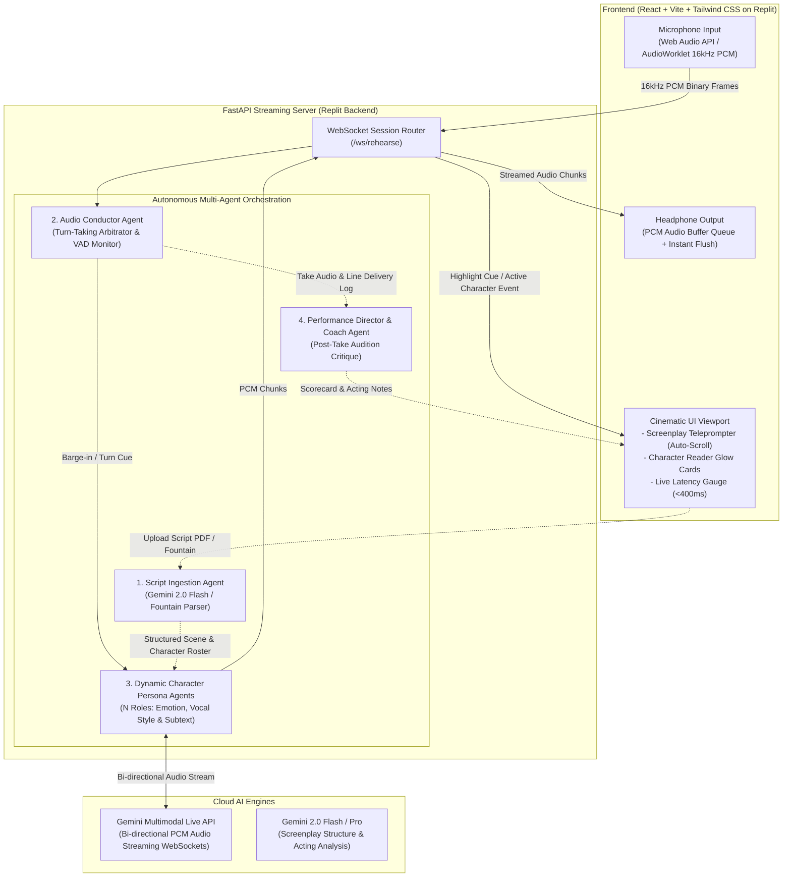

# ActorRoom Live (`P-CINEMA-HACK-1.1`): System Architecture & Technical Specification

> **Challenge:** [Devpost Agentic Cinema: The Blockbuster Hackathon](https://agentic-cinema.devpost.com/)  
> **Track:** **Replit Agent Track** ($7,500 1st / $4,500 2nd / $3,000 3rd)  
> **Status:** Phase 1 Complete (Architectural Specification Approved)  
> **Target Deployment:** Replit Hosted Web App + Gemini Multimodal Live API

---

## 🎬 1. Executive Summary & Core Vision

**ActorRoom Live** is an ultra-low-latency (<400ms) multi-agent audition rehearsal sandbox designed for film and television actors preparing self-tape auditions.

### The Real-World Film Problem
- In self-tapes, almost every scene involves 2 to 4 characters. Actors need an off-camera "Reader" to deliver opposing dialogue with authentic timing, tone, and emotional cues.
- Human reader services (e.g., WeRehearse) cost $30–$60/hour and require booking in advance.
- Friends and roommates read flatly and miss cues.
- Traditional rehearsal apps (ColdRead, Script Rehearser) merely replay pre-recorded robotic audio files separated by fixed, awkward silence timers.
- Mainstream voice assistants (ChatGPT Voice, standard Gemini app, Siri) have 1.5–3.0 second round-trip lag, speak in a single monotone voice, cannot parse screenplay formats, cannot embody multiple opposing characters simultaneously, and lack natural actor barge-in / interruption cutoffs.

### The ActorRoom Solution
An actor uploads a screenplay PDF or `.fountain` file, selects their role, and ActorRoom Live instantly spawns distinct AI character agents for all opposing roles. The actor speaks naturally into their microphone. The AI characters respond in real-time (<400ms) with emotional subtext, distinct vocal personas, and sub-150ms barge-in cutoffs. Upon completing the scene, an AI Director Agent delivers an objective acting critique and pacing scorecard.

---

## 🏗️ 2. High-Level System Architecture Diagram



---

## ⏱️ 3. Sub-400ms Latency Budget & Barge-in Protocol

To recreate the natural cadence of a professional table read or audition room, the turnaround between the actor concluding a line and the AI dialogue partner beginning their response must remain under **400 milliseconds**.

### Turnaround Latency Breakdown
| Stage | Target Latency | Technical Mechanism |
| :--- | :---: | :--- |
| **1. Client Mic Capture** | `40 ms` | AudioWorklet captures 16kHz 16-bit mono PCM in 40ms packets (640 samples). |
| **2. WebSocket Uplink** | `30 ms` | Binary WebSocket transfer directly to FastAPI backend. |
| **3. Conductor VAD & Turn Decision** | `60 ms` | WebRTC VAD / energy threshold confirms speech cessation & matches script cue. |
| **4. Gemini Live API First-Chunk TTFT** | `180 ms` | Bi-directional streaming session without slow STT -> LLM -> TTS serialization. |
| **5. WebSocket Downlink** | `30 ms` | Server binary stream to frontend client. |
| **6. Audio Buffer & Playback Ingestion** | `40 ms` | AudioContext buffer begins continuous streaming into headphones. |
| **Total Roundtrip Turn Latency** | **~380 ms** | **Sub-400ms human conversational threshold achieved** |

### ⚡ Sub-150ms Interruption & Barge-in Protocol
In film acting, characters frequently interrupt, step on lines, or cut each other off. Traditional voice bots continue talking over the human. ActorRoom Live implements instant barge-in cutoff:
1. When AI is speaking and the actor begins talking, client AudioWorklet detects energy `> -32 dBFS`.
2. Client transmits a zero-payload control frame: `{"type": "INTERRUPT"}`.
3. Server halts outgoing Gemini Live audio streaming immediately.
4. Client executes `audioSource.stop()` and purges pending audio buffer queues in **< 100ms**.
5. The AI partner yields immediately, allowing the actor full vocal authority.

---

## 🤖 4. The 4 Autonomous Agents

### Agent 1: Script Ingestion & Character Segmentation Agent (`script_parser_agent.py`)
- **Role:** Screenplay Ingestion and Structural Breakdown.
- **Engine:** Gemini 2.0 Flash + Fountain Screenplay Parser.
- **Functions:**
  - Ingests raw `.fountain` text or multi-page PDF scripts.
  - Normalizes scene headings (`INT. DETECTIVE OFFICE - NIGHT`), character cues (`MILLER`, `VIKTOR`), parentheticals (`(whispering)`, `(smiling coldly)`), and spoken lines.
  - Extracts character relationship dynamics, emotional baselines, and objective stakes.
  - Outputs a structured JSON scene sequence ready for real-time tracking.

### Agent 2: Audio Conductor & Turn-Taking Arbitrator (`conductor_agent.py`)
- **Role:** Audition Conductor & Scene Synchronization.
- **Functions:**
  - Maintains the real-time scene pointer (which line and which character is active).
  - Listens to incoming user audio streams and detects speech end-points via VAD.
  - Compares the actor's spoken input against the script cue.
  - Handles missed lines, pauses, or ad-libs: if the actor hesitates, the conductor can prompt them or signal the opposing character agent to jump in.
  - Dispatches visual sync events to the client teleprompter to highlight the current line.

### Agent 3: Dynamic Character Persona Agents (`character_agent.py`)
- **Role:** Opposing Role Dialogue Partners.
- **Engine:** Gemini Multimodal Live API over persistent WebSockets.
- **Functions:**
  - Spawns independent character agents for every opposing role in the scene.
  - Assigns unique Gemini Live vocal models (`Aoede`, `Charon`, `Fenrir`, `Kore`, `Puck`).
  - Constrains responses strictly to the screenplay dialogue while modulating emotional delivery based on parentheticals and the actor's vocal intensity.
  - Streams raw PCM audio back to the client at 24kHz/16kHz.

### Agent 4: Performance Director & Audition Coach Agent (`director_agent.py`)
- **Role:** Post-Take Objective Acting Analysis.
- **Engine:** Gemini 2.0 Flash / Pro.
- **Functions:**
  - Triggers automatically when the actor hits **"Cut & Review Take"**.
  - Computes:
    - **Pacing & Rhythm Score (0–100%)**: Evaluates cue pickups, hesitation gaps, and scene velocity.
    - **Line Accuracy Score (0–100%)**: Evaluates verbatim memorization vs. ad-libbing.
    - **Emotional Commitment & Tone**: Generates actionable, constructive notes in standard film director terminology (e.g., *"Pick up the cue on line 4 faster"*, *"Give Viktor more menace in the opening interrogation"*).

---

## 📡 5. WebSocket Communication Protocol

Communication between the React client and FastAPI server occurs over `/ws/rehearse`.

### Client -> Server Messages
1. **`START_SESSION`** (JSON)
   ```json
   {
     "type": "START_SESSION",
     "script_id": "interrogation_room",
     "user_character": "DETECTIVE MILLER",
     "sample_rate": 16000
   }
   ```
2. **Audio Frame** (Binary)
   - Raw 16-bit Mono Linear PCM chunks (640 samples = 40ms per frame).
3. **`INTERRUPT`** (JSON)
   ```json
   {
     "type": "INTERRUPT",
     "timestamp": 128492.4
   }
   ```
4. **`END_TAKE`** (JSON)
   ```json
   {
     "type": "END_TAKE"
   }
   ```

### Server -> Client Messages
1. **`SESSION_READY`** (JSON)
   - Confirms session start, active opposing characters, and starting cue.
2. **Audio Frame** (Binary)
   - Streamed PCM audio for the opposing character's line.
3. **`LINE_SYNC`** (JSON)
   ```json
   {
     "type": "LINE_SYNC",
     "current_turn_index": 3,
     "speaker": "VIKTOR",
     "line_text": "I was at the docks, Detective. Check the security cameras.",
     "emotion": "defiant"
   }
   ```
4. **`DIRECTOR_REPORT`** (JSON)
   ```json
   {
     "type": "DIRECTOR_REPORT",
     "pacing_score": 88,
     "line_accuracy": 94,
     "overall_rating": "Strong Callback Potential",
     "director_notes": [
       "Great tension on the opening confrontation.",
       "Slight pause before line 7; pick up the cue faster for sharper interrogation rhythm."
     ]
   }
   ```

---

## 📁 6. Repository Layout

```text
actorroom-live/
├── ARCHITECTURE.md                 # Complete System Architecture & Technical Specification
├── README.md                       # Devpost submission guide, Replit run instructions & demo
├── LICENSE                         # Apache 2.0 / MIT Open Source License
├── replit.nix                      # Replit environment dependencies
├── .replit                         # Replit run configuration (FastAPI + React)
│
├── backend/
│   ├── app/
│   │   ├── __init__.py
│   │   ├── main.py                 # FastAPI server & WebSocket router
│   │   ├── config.py               # Settings & API keys (GEMINI_API_KEY)
│   │   ├── agents/
│   │   │   ├── __init__.py
│   │   │   ├── script_parser_agent.py # Gemini 2.0 screenplay parser
│   │   │   ├── conductor_agent.py     # Turn-taking arbitrator & VAD sync
│   │   │   ├── character_agent.py     # Multi-character persona manager
│   │   │   └── director_agent.py      # Post-take critique & scoring engine
│   │   ├── services/
│   │   │   ├── __init__.py
│   │   │   ├── gemini_live.py         # Gemini Multimodal Live API WebSocket bridge
│   │   │   ├── audio_pipeline.py      # PCM audio chunking, VAD & formatters
│   │   │   └── fallback_tts.py        # Streaming audio fallback (Cartesia/Edge/ElevenLabs)
│   │   ├── parsers/
│   │   │   ├── __init__.py
│   │   │   └── fountain_parser.py     # Screenplay format parser (.fountain / PDF)
│   │   └── schemas/
│   │       ├── __init__.py
│   │       └── models.py              # Pydantic schemas (Script, Scene, Turn, Critique)
│   ├── sample_scripts/
│   │   ├── interrogation_room.fountain # Detective thriller audition scene
│   │   └── cafe_breakup.fountain       # Dramatic multi-character audition scene
│   ├── requirements.txt
│   └── .env.example
│
└── frontend/
    ├── index.html
    ├── package.json
    ├── vite.config.ts
    ├── tailwind.config.js
    ├── postcss.config.js
    ├── src/
    │   ├── main.tsx
    │   ├── App.tsx
    │   ├── audio/
    │   │   ├── audioRecorder.ts       # AudioWorklet 16kHz PCM stream capture
    │   │   └── audioPlayer.ts          # PCM audio queue & instant barge-in flush
    │   ├── components/
    │   │   ├── Teleprompter.tsx        # Screenplay teleprompter with auto-scroll
    │   │   ├── CharacterAvatars.tsx    # Reactive glowing speaker cards
    │   │   ├── LatencyMonitor.tsx      # Real-time roundtrip latency meter & waveform
    │   │   ├── ScriptSelector.tsx      # Script loader & character role picker
    │   │   └── DirectorCritiqueModal.tsx # Post-take director notes & scorecard
    │   ├── types/
    │   │   └── index.ts               # Shared TypeScript interfaces
    │   └── index.css                  # Cinematic Dark-Mode styling
```

---

## 🎯 7. Next Implementation Steps
1. **Backend Core**: Scaffold `backend/` directory, Pydantic schemas, Fountain parser, sample audition scripts, and `requirements.txt`.
2. **Multi-Agent Engine**: Implement `script_parser_agent.py`, `conductor_agent.py`, `character_agent.py`, and `director_agent.py`.
3. **Streaming & WebSocket Layer**: Implement `main.py` and `gemini_live.py` with full duplex streaming and barge-in cutoffs.
4. **Cinematic Frontend**: Scaffold `frontend/` with Vite React + Tailwind, AudioWorklet PCM recorder, instant audio flush player, and teleprompter UI.
5. **Replit Configuration**: Setup `.replit` and `replit.nix` for zero-setup one-click run.
